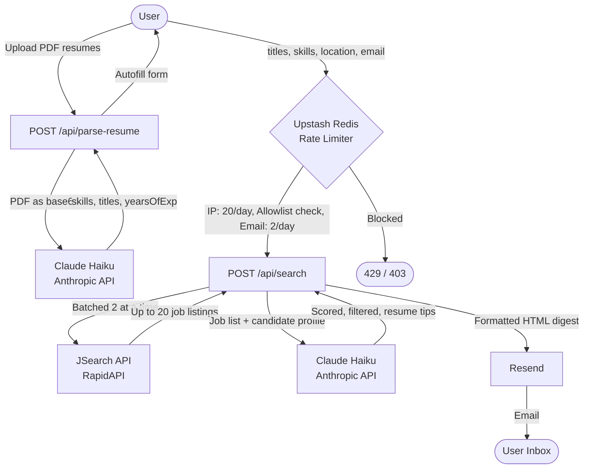
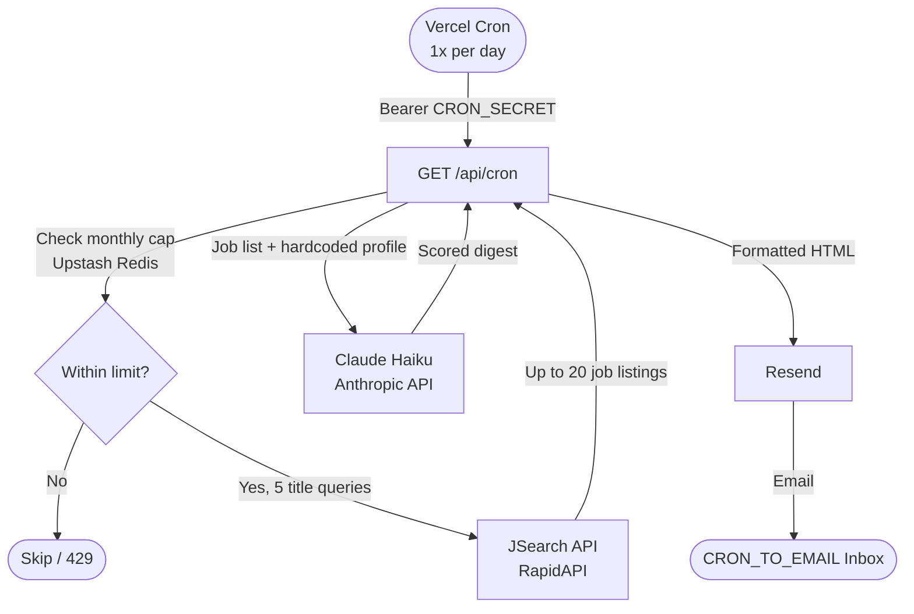

# Job Scout

AI-powered job search agent that finds roles posted in the last 7 days across your selected locations (in-office, hybrid, or remote). Searches LinkedIn, Indeed, Glassdoor, ZipRecruiter, and more via JSearch, scores matches against your skills using Claude AI, and delivers results to your inbox.

---

## Features

- **Resume upload** — upload up to 3 PDFs; Claude extracts your skills, job titles, and years of experience and autofills the form
- **Per-job resume matching** — each result in the email identifies the best-fit resume and gives tailored tips
- **Editable tags** — customize job titles (5 max), skills, and location (1 max) before searching
- **Years of experience slider** — set manually or autofilled from your resume (career breaks excluded)
- **Batched job fetching** — parallel requests across all titles, 2 at a time with rate-limit-safe delays
- **AI scoring** — Claude Haiku scores each listing 1–10, reports skills matched and missing
- **Email delivery** — results sent to your inbox with formatted HTML; nothing shown in the UI
- **Daily cron digest** — automated search runs once per day via Vercel Cron and emails a digest
- **Abuse protection** — IP rate limiting, email allowlist, per-email daily caps, and monthly API usage cap

---

## How it works

### Manual search flow



### Daily cron flow



---

## Tech stack

| Layer | Tool |
|-------|------|
| Framework | Next.js 15 (App Router) |
| Styling | Tailwind CSS |
| AI | Claude Haiku (`claude-haiku-4-5-20251001`) via Anthropic SDK |
| Job data | JSearch API (RapidAPI) |
| Email | Resend |
| Rate limiting / storage | Upstash Redis |
| Cron | Vercel Cron Jobs |

---

## Prerequisites

- [Node.js](https://nodejs.org/) v18+
- [Anthropic API key](https://platform.anthropic.com/)
- [JSearch API key](https://rapidapi.com/letscrape-6bRBa3QguO5/api/jsearch) via RapidAPI — Pro plan recommended ($25/month, 10,000 calls/month)
- [Resend account](https://resend.com) — free tier (3,000 emails/month)
- [Upstash Redis](https://upstash.com) — free tier works fine

---

## Setup

1. Clone the repo and install dependencies:
   ```bash
   npm install
   ```

2. Copy the env template and fill in your keys:
   ```bash
   cp .env.example .env.local
   ```

3. Run locally:
   ```bash
   npm run dev -- -p 3001
   ```
   Open [http://localhost:3001](http://localhost:3001).

---

## Environment variables

| Variable | Description |
|----------|-------------|
| `ANTHROPIC_API_KEY` | From [platform.anthropic.com](https://platform.anthropic.com) |
| `JSEARCH_API_KEY` | RapidAPI key for JSearch |
| `RESEND_API_KEY` | From [resend.com](https://resend.com/api-keys) |
| `RESEND_FROM_EMAIL` | Verified sender address (e.g. `Job Scout <scout@yourdomain.com>`) |
| `CRON_TO_EMAIL` | Email address for the daily scheduled digest |
| `CRON_SECRET` | Secret token used to authenticate Vercel Cron requests |
| `EXEMPT_EMAIL` | Your personal email — bypasses the allowlist and gets a 50/day rate limit |
| `JSEARCH_MONTHLY_LIMIT` | Max JSearch API calls per month (default: `9800`) |
| `UPSTASH_REDIS_REST_URL` | From your Upstash Redis dashboard |
| `UPSTASH_REDIS_REST_TOKEN` | From your Upstash Redis dashboard |

---

## Abuse protection

Both API routes are protected against scripted abuse:

| Layer | Limit |
|-------|-------|
| IP rate limit (search) | 20 requests / IP / day |
| IP rate limit (parse-resume) | 10 requests / IP / day |
| Email allowlist | Only emails added to Redis can trigger a search |
| Email rate limit | 2 searches / email / day |
| Exempt email rate limit | 50 searches / day for `EXEMPT_EMAIL` |
| Monthly API cap | Configurable via `JSEARCH_MONTHLY_LIMIT` (default 9,800) |
| Input sanitization | Max 5 titles, 1 location, 30 skills — each string capped at 100 chars |

### Adding an email to the allowlist

Use the Upstash Redis CLI or REST API:
```
SADD job-scout:allowed-emails user@example.com
```

---

## Cron job

The daily digest is configured in `vercel.json` and runs automatically on Vercel. To change the schedule, edit the `crons` entry:

```json
{
  "crons": [
    {
      "path": "/ai-lab/job-search-agent/api/cron",
      "schedule": "0 13 * * *"
    }
  ]
}
```

Times are UTC. The cron handler in `app/api/cron/route.ts` contains the hardcoded titles, skills, and location for the digest. Update those arrays to match your profile.

---

## Project structure

| Path | Purpose |
|------|---------|
| `app/page.tsx` | Web UI — resume upload, tag inputs, experience slider, email, run button |
| `app/api/search/route.ts` | Streaming API route — fetches jobs, runs Claude, sends email |
| `app/api/parse-resume/route.ts` | Parses uploaded PDF resumes with Claude, returns skills/titles/experience |
| `app/api/cron/route.ts` | Vercel Cron handler — daily digest for a fixed profile |
| `lib/jsearch.ts` | `Job` interface and `fetchJobs()` with retry logic |
| `lib/usage.ts` | Redis client, monthly usage counter, `checkAndIncrementUsage()` |
| `lib/email.ts` | `formatEmailHtml()` — shared HTML email formatter |
| `vercel.json` | Vercel Cron schedule |
| `.env.example` | Template for all required environment variables |

---

## Cost estimate

Using Claude Haiku (`$1/M input`, `$5/M output`):

| Run | Estimated tokens | Cost |
|-----|-----------------|------|
| Manual search (20 jobs, 1,500-char JDs) | ~5,000 in + ~1,500 out | ~$0.013 |
| Resume parse (1 PDF) | ~2,000 in + ~300 out | ~$0.003 |
| Daily cron digest (20 jobs, 300-char JDs) | ~2,200 in + ~800 out | ~$0.006 |
| Monthly (30 days cron only) | — | ~$0.18 |